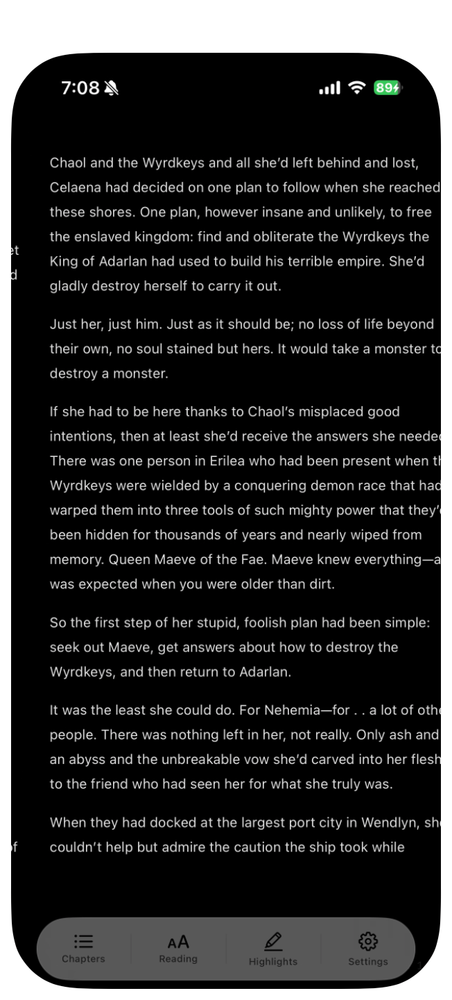

layout is weird on phone due to margin sliders.  

Addcitionally, it's possible to cause the same issue on desktop by rapidly swiping or otherwise sending page turn inputs (like mashing the next/previous buttons on the lock screen)